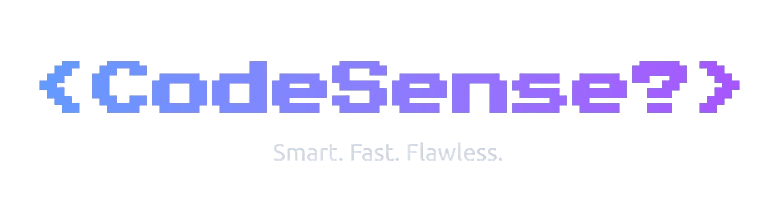

<div align="center">



<br><br>


</div>


**CodeSense** is an intelligent code analysis system that automates and streamlines the code review process in modern development environments. Powered by advanced AI models like **Ollama Llama 3.2** and **Gemini API**, it provides comprehensive code analysis through a responsive web interface and seamless GitHub Actions integration.

---

<div align="center">

## ✨ Features

</div>

🤖 **Intelligent Code Analysis**  
Advanced AI models detect security vulnerabilities, performance issues, and code quality concerns

🌐 **Dual-Platform Solution**  
Responsive web interface + GitHub Actions integration

📊 **Automated Reporting**  
Comprehensive markdown reports for clear team communication

🔄 **Language-Agnostic Support**  
Compatible with diverse tech stacks and microservices

🧩 **Model Flexibility**  
Supports multiple AI models (Ollama Llama 3.2, Gemini API)

---

<div align="center">

## 🏗️ System Architecture

</div>

### 🎨 Web Application

#### Frontend
```
📱 Framework: React with Vite
🔷 Language: TypeScript
🎯 Styling: Tailwind CSS
📤 Features: Text paste and file upload
```

#### Backend
```
⚡ Server: Python Flask
🧠 AI: Ollama Llama 3.2 / Gemini API
⚙️ Processing: Custom prompts and formatting
```

### 🔗 GitHub Integration
```
📋 Custom YAML Workflow
📝 Automated PR Reports
```

---

<div align="center">

## 📋 Prerequisites

</div>

Before setup, install:

 Download from [nodejs.org](https://nodejs.org)  
 Download from [python.org](https://python.org)  
 See [Ollama's GitHub](https://github.com/ollama/ollama)  
🔑 **Gemini API Key** (if using Gemini)

---

<div align="center">

## 🚀 Installation

</div>

### 1️⃣ Clone Repository
```bash
https://github.com/suraj0-11/codesense-basic.git
cd codesense-basic
```

### 2️⃣ Frontend Setup
```bash
cd frontend
npm install
```
Create a `.env` file in the `frontend` directory with the required environment variables.

### 3️⃣ Backend Setup
```bash
cd ../backend
python3 -m venv venv
source venv/bin/activate  # Windows: venv\Scripts\activate
pip install -r requirements.txt
```
Create a `.env` file in the `backend` directory with the necessary configuration.

---

<div align="center">

## 🖥️ Running the Application

</div>

### 1️⃣ Start Backend Server
```bash
# Ensure virtual environment is activated
python main.py
```

### 2️⃣ Start Frontend Development Server
```bash
cd frontend
npm run dev
```

---

<div align="center">

## ⚙️ GitHub Actions Setup

</div>

### 1️⃣ Configure Repository Settings
- Navigate to repository **Settings → Actions → General**
- Enable Actions
- Set **Workflow permissions** to **Read and write**

### 2️⃣ Create Workflow File
- Create `.github/workflows/code-analysis.yml`
- Copy configuration from `.github/workflows/ai-code-review.yml`

---

<div align="center">

## 📈 Expected Outcomes

</div>

🎯 **Enhanced Code Quality**  
Immediate AI-powered analysis for issue identification and resolution

⚡ **Streamlined Workflow**  
Intuitive interface and automated reporting for faster development

🔄 **Automated Repository Management**  
Continuous feedback for pull requests and code reviews

📈 **Scalable Platform**  
Supports large codebases and future enhancements

---

<div align="center">

## 👥 Contributors

[](https://github.com/Rubbershredder/)
[](https://github.com/NikZone1)
[](https://github.com/suraj0-11)

We welcome contributions from the community! Please follow standard GitHub pull request procedures.

</div>

---

<div align="center">

## 🙏 Acknowledgments


</div>

---

<div align="center">

## 📝 Notes on AI Models

</div>

This project is designed to work with multiple AI models, including **Ollama Llama 3.2** and **Gemini API**. While the system has been tested and verified for Gemini and Ollama, it is flexible enough to integrate with other compatible models. Ensure you configure the appropriate API keys and settings in the `.env` files for seamless operation.

---

<div align="center">

For issues or feature requests, please open an issue on the [GitHub repository](https://github.com/suraj0-11/codesense-basic.git).

Happy coding! 🚀

</div>
